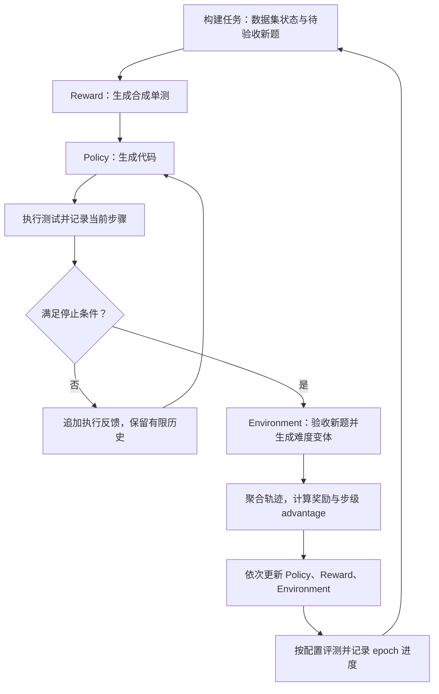

# VICO-CodeAgent

**让代码模型学习“执行 → 读取反馈 → 修正”：面向多步 Code Agent 的强化学习训练系统。**

[运行指南](项目介绍/VICO%20怎么跑项目.md) · [核心配置](configs/coding_rl.yaml) · [测试](tests) · [改动归属](NOTICE) · [Apache-2.0](LICENSE)

VICO-CodeAgent 将代码生成从一次作答扩展为多步交互：Policy 生成代码，在执行器中运行测试，再根据反馈修正答案；Reward 模型生成合成单测；Environment 模型根据当前解题表现调整训练题目。三个模型按阶段交替更新，形成任务生成、交互采样、奖励计算和训练的闭环。

项目基于 RLAnything / Open-AgentRL 的 coding 设置扩展。重点改动是**多步轨迹建模、步级信用分配、双维度奖励，以及执行调度与状态持久化**；三模型训练框架和 PPO-Clip + K3 KL 目标继承自上游，详见 [NOTICE](NOTICE)。

## 从哪里看这个项目

| 关注点 | 实现与取舍 | 源码入口 |
|---|---|---|
| Agent 交互建模 | 记录每一步的上下文、代码和执行结果；按成功、无改善或步数上限终止，控制交互成本 | [多步 rollout](sample/llm_policy_rollout.py) |
| RL 信用分配 | 同题、同步数的轨迹做组内标准化；提前结束的轨迹保留末次分数作比较，只训练实际发生的步骤 | [advantage](reward/advantage.py)、[奖励与样本构建](reward/llm_rl_reward.py) |
| 奖励设计 | 用 GT 与合成测试的通过比例提供细粒度信号；将交互停止条件与完整 GT 评测分开 | [奖励计算](reward/llm_rl_reward.py)、[默认权重](configs/coding_rl.yaml) |
| 执行调度 | 分块并发、判题超时与硬超时、运行中排空输出队列，处理死循环和大输出 | [执行器](common/sandbox.py) |
| 训练与显存 | response 区域 logits、分块 FP32 log-softmax、batch padding 裁剪；记录 KL、裁剪比例和 loss | [训练器](train/coding_train.py) |
| 状态与恢复 | 唯一临时文件、原子替换、POSIX 文件锁；按完整 epoch 记录进度 | [持久化](common/safe_io.py)、[训练主控](coding_rl.py) |

阅读顺序建议：`coding_rl.py` → `sample/llm_policy_rollout.py` → `reward/advantage.py` → `train/coding_train.py`。这条路径覆盖一次训练迭代的数据流与更新逻辑。

## 系统流程



| 模型 | 职责 | 学习信号 |
|---|---|---|
| Policy | 根据题目和执行反馈逐步修正代码 | 每一步的 GT / 合成测试通过比例，经组内标准化后作为 advantage |
| Reward | 生成用于反馈和评分的合成单测 | 测试是否放过正确代码、拦下错误代码 |
| Environment | 生成更难或更易的题目，调整训练任务 | 下一轮 Policy 作答后，依据难度变化与可解性结算奖励 |

## 核心设计

### 多步交互与评测分离

默认每题采样 32 条轨迹，每条最多 5 步；连续 2 步反馈分数没有提升则终止，上下文保留最近 2 轮交互。vLLM worker 在一次多步 rollout 内复用。

默认停止条件中的“成功”指**公开 GT 样例全部通过**，不代表完整测试集通过。合成测试可能有误，因此默认只作为反馈，不阻止轨迹结束；设 `success_criterion: all_feedback` 可要求同时通过合成测试。完整 GT 测试用于评分，未公开测试的内容不作为逐项交互反馈。

### 双维度奖励与步级 advantage

```text
r(i, s) = GT_pass_ratio(i, s) + λ × synthetic_pass_ratio(i, s)
λ = 0.3（默认），奖励范围为 [0, 1.3]

held_reward(i, s) = r(i, min(s, last_step_i))
A(i, s) = (held_reward(i, s) - group_mean_s) / group_std_s
```

部分测试通过率可以区分“全部未通过完整判题，但接近正确程度不同”的解；如果一组得分仍然相同，advantage 就是 0，并不会凭空产生学习信号。

提前结束的轨迹沿用最后分数参与后续比较，但不会补造训练步骤。接近生成长度上限的步骤按实现置零；零 advantage 样本被丢弃。默认还过滤首次完整 GT 通过率不在 `[0.2, 0.8]` 的题目的 Policy 样本，阈值可配置。

训练沿用 token 级 PPO-Clip 与 K3 KL 正则。这里的 KL 相对于旧策略的 log probability，**没有单独的冻结 reference 模型**。

### 执行与训练工程

- **执行器**：每个代码 / 测试组合运行在独立进程中，默认每块最多并发 128 个进程；按题目时限判定超时，并设置 30 秒硬上限。父进程在子进程运行时读取输出队列，避免大输出堵塞。
- **状态持久化**：JSON 写入使用同目录唯一临时文件、`fsync` 和 `os.replace`；读改写操作通过 POSIX `flock` 串行化。
- **训练显存**：在模型支持时只计算 response 区域 logits，分块计算 FP32 log-softmax，并裁剪 batch padding；实际显存与吞吐需在目标模型和硬件上测量。
- **恢复粒度**：完成整轮后写入 `progress.json`；模型与 tokenizer 先保存到临时目录再切换。当前恢复按 epoch 和已保存权重继续，不承诺优化器状态或轮内步骤的精确恢复。

执行器包含资源限制与危险调用拦截，但进程隔离不是完整的安全边界。运行模型生成代码应使用隔离的 Linux 容器或虚拟机。

## 快速开始

完整训练面向 **Linux + NVIDIA GPU**，默认配置以单机 8 GPU 为目标，模型路径由使用者填写。`8×A100 80GB / 4B 模型`是项目的目标配置，不是本仓库附带的实测性能结论。GPU 分组、上下文长度与 batch size 需要按实际环境调整。

```bash
git clone https://github.com/NOAH1ARK/VICO-CodeAgent.git
cd VICO-CodeAgent

conda create -n vico python=3.10 -y
conda activate vico
python -m pip install -r requirements.txt

cd data
python download_data.py --dataset CodeContests_train
python download_data.py --dataset LiveBench-ReasonFlux
cd ..
```

在 `data/` 目录运行 [预处理 notebook](data/preprocess_data.ipynb)，分别核对两份数据的输入 / 输出文件、测试时限与测试截取数量。然后编辑 [训练配置](configs/coding_rl.yaml) 中的 `system.*`、`model.*` 和 GPU 分组。依赖版本以 [requirements.txt](requirements.txt) 为准，安装与小规模验证步骤见 [运行指南](项目介绍/VICO%20怎么跑项目.md)。

```bash
# 从头训练
python coding_rl.py config=configs/coding_rl.yaml

# 根据 progress.json，从下一未完成 epoch 继续
python coding_rl.py config=configs/coding_rl.yaml experiment.start_from_scratch=False

# 先填写评测配置中的环境与模型路径，再独立评测
python coding_eval.py config=configs/coding_eval.yaml
```

调整 rollout / training 等阶段参数时，直接修改 YAML；子进程会重新读取对应配置文件，主控的命令行覆盖不会自动传给所有阶段。从头训练会清理该实验目录的临时状态，已有实验继续运行时应使用恢复模式。

## 验证与实验记录

无需 GPU 即可在 Linux 上运行基础测试：

```bash
python -m pip install -r requirements-dev.txt
python -m pytest -v
python -m ruff check .
```

| 测试文件 | 覆盖行为 |
|---|---|
| [test_advantage.py](tests/test_advantage.py) | 奖励组合、截断置零、组内标准化、提前终止轨迹的末次得分保持 |
| [test_sandbox.py](tests/test_sandbox.py) | 正误代码、异常、死循环、大输出、调度顺序、资源限制 |
| [test_safe_io.py](tests/test_safe_io.py) | JSON 原子写入、缺失文件默认值、多进程并发更新 |

完整执行器与文件锁测试依赖 Linux / POSIX；Windows 上可单独检查纯 Python 奖励逻辑：`python -m pytest tests/test_advantage.py -v`。

| 输出 | 用途 |
|---|---|
| `coding_rl/results/metrics-{train,eval}.jsonl` | 首次与最终通过率、多步修复率、平均交互步数、组内奖励标准差 |
| `coding_rl/logs/train_metrics.jsonl` | loss、KL、clip fraction、学习率 |
| `coding_rl/ckpt/` | 三个模型的权重、tokenizer 与定期快照 |
| `coding_rl/progress.json` | 最近完成的 epoch |

指标中的 `pass@1` 按**各轨迹末步通过全部 GT 的比例**汇总；`multi_step_repair_rate` 是首次失败轨迹中最终通过的比例。这里的完整 GT 指预处理后保留的测试，比较实验时需要对齐数据、测试数量、采样温度、候选数量、最大步数与 token 预算。

仓库保留了 [训练曲线图片](项目介绍/训练曲线)，但尚未随库发布对应原始指标日志、checkpoint 和完整实验清单，因此这里不据此宣称性能提升或基准排名。基础测试也不能替代完整 GPU 训练验证。

## 项目结构

```text
VICO-CodeAgent/
├── coding_rl.py / coding_eval.py   # 训练与评测入口
├── configs/                       # 模型、数据与各阶段参数
├── accelerate_configs/            # DeepSpeed / Accelerate 配置
├── sample/                        # 任务构建与三个模型的 rollout
├── reward/                        # 奖励、步级 advantage、聚合与重判
├── train/                         # 训练器与相关工具
├── common/                        # 执行器、JSON 持久化与文件锁
├── data/                          # 下载与预处理
├── tests/                         # 基础行为测试
└── 项目介绍/                      # 运行指南与已有曲线
```

## 来源与许可证

本项目基于 [RLAnything / Open-AgentRL](https://github.com/Gen-Verse/Open-AgentRL) 的 coding 设置，保留 Apache-2.0 许可证与上游归属。联合训练框架和 PPO-Clip + K3 KL 目标来自上游；本仓库的主要扩展及逐文件归属见 [NOTICE](NOTICE)。部分训练工具保留 HuggingFace / Optuna 作者的原始版权头。

许可证：[Apache License 2.0](LICENSE)。
