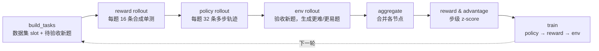

<div align="center">

# VICO-CodeAgent

**面向多步 Code Agent 的 Agentic RL：Policy / Reward / Environment 三模型协同优化**

[English](README.md) | 中文

</div>

---

VICO-CodeAgent 把代码生成的单轮 RL 扩展成**多步 Agentic RL**：模型写代码，代码在沙箱里执行，模型读执行反馈后修改代码，最多迭代若干轮。三个 LLM 在闭环中一起训练：

| 模型 | 作用 | 学习信号 |
|---|---|---|
| **Policy** | 以“执行→反馈→修正”的多步方式解题 | 双维度 reward 上的步级组内相对 advantage |
| **Reward**（单测生成器） | 生成合成单测，既作为反馈，也是 reward 的一部分 | 合成单测区分正确代码和错误代码的能力 |
| **Environment** | 验收新题，并根据 policy 的正确率生成更难或更易的新题 | 延迟一轮的奖励：等 policy 做完新题后再结算 |

默认配置在单机 8×A100 80GB 上训练 4B 规模的 Qwen 模型。训练用 DeepSpeed ZeRO-3 + BF16，rollout 用 vLLM 张量并行。

## 亮点

- **多步 agent rollout**：每一步的执行结果（公开 GT 样例和合成单测的输入、期望输出、实际输出和判定）追加到消息栈。终止条件有三种：成功、连续 `patience` 步没有提升、达到 `max_steps`。vLLM 引擎在各步之间一直保持加载。
- **步级信用分配**：用 `(trajectory_uid, step_index)` 追踪每一步，每一步单独作为一条训练样本。同一道题的 32 条轨迹在同一个 step 上做组内 z-score。已终止的轨迹在后续步沿用最后一步的分数，这样一次“修复”会和其他尝试在同一时刻的水平作比较。
- **双维度 reward**：`r = GT 通过率 + 0.3 × 合成单测通过率`，范围 [0, 1.3]。二值 reward 在一组轨迹全错时没有梯度；双维度 reward 仍能区分接近正确和差得很远的代码。组内 reward 标准差会分别按双维度和二值两种算法记录，方便对比。
- **自演化课程**：Env 模型根据 policy 在某道题上的正确率生成更难或更易的变体。只有难度朝要求的方向变化、并且仍然可解的新题才会被接受。
- **稳健的执行与容错**：批量进程沙箱、原子写入加文件锁的状态文件、防崩溃的 checkpoint，可以从任意 epoch 断点续训。

## 一个 epoch 的流程



| # | 阶段 | 脚本 |
|---|---|---|
| 1 | 从持久化的数据集状态和待验收新题构建本轮任务 | `sample/build_tasks.py` |
| 2 | 生成合成单测 | `sample/llm_reward_rollout.py` |
| 3 | 在沙箱中做多步 agent rollout | `sample/llm_policy_rollout.py` |
| 4 | 环境演化 | `sample/llm_env_rollout.py` |
| 5 | 合并各节点结果 | `reward/rl_aggregate_data.py` |
| 6 | 计算 reward、advantage 和指标 | `reward/llm_rl_reward.py`、`reward/advantage.py` |
| 7 | 三个模型的 PPO 更新 | `train/coding_train.py` |

成功的定义是公开 GT 样例全部通过。合成单测只给模型作参考，不参与成功判定，避免错误的合成单测卡住正确解；设 `success_criterion: all_feedback` 可恢复严格规则。每一步还会在**全部**隐藏 GT 和合成单测上判分，用来计算 reward。

## 方法

- **步级 reward**：`r_{i,s} = pass_GT + λ·pass_syn`，λ=0.3。生成被 `max_gen_length` 截断的步记 0 分。
- **步级 advantage**：同一题的 N=32 条轨迹，在第 s 步取 `r̃_{i,s} = r_{i,min(s,T_i)}`（已终止的轨迹沿用最后一步的分数），然后做组内 z-score。只有真实执行过的步才作为样本，advantage 为 0 的样本丢弃。第 1 步正确率不在 `first_step_acc_range`（默认 [0.2, 0.8]）内的题，不参与 policy 更新。
- **目标函数**：token 级 PPO-Clip（ε=0.2）加 K3 估计的 KL（β=0.01）。注意 KL 是相对 rollout 时的旧策略计算的，作用是 trust-region 式的正则，不是相对冻结 reference 模型的 KL。
- **Reward 模型**：一条合成单测如果所有正确代码都能通过，奖励为它拦下的错误代码数量；如果有正确代码通不过，惩罚为它放过的错误代码数量。
- **Env 模型**：延迟奖励。新题被接受 +1，难度调错方向 −0.5，policy 完全做不出 −1，格式无效 −1。

## 工程实现

| 问题 | 方案 |
|---|---|
| 每步要执行成千上万个（代码，单测）组合 | `common/sandbox.py`：每个组合一个 `multiprocessing.Process`，重定向 stdin/stdout；同一步的所有请求在一次调度里完成，每块最多同时运行 128 个进程。 |
| 死循环、僵尸进程 | 两级超时：按每题的 `test_time_limit` 判 TLE（向子进程发 SIGTERM），超过 30 秒硬上限直接 SIGKILL。 |
| 大输出被误判为超时 | 子进程运行期间父进程就持续读取输出队列。 |
| 运行模型生成的不可信代码 | 尽力而为的加固：私有工作目录，`RLIMIT_AS`（在 fork 时的内存占用基础上 +2GB），`RLIMIT_FSIZE`，禁止 core dump，执行期间禁用危险的 `os`/`shutil`/`subprocess` 调用。**这不是安全边界，请在容器中训练。** |
| 共享状态文件的写入撕裂和竞态 | `common/safe_io.py`：唯一临时文件 + `fsync` + `os.replace`，“读—改—写”用 `flock` 串行化。 |
| 保存 checkpoint 时崩溃 | 先写到临时目录再原子替换，每 `save_every` 轮另存一份快照。 |

## 快速开始

```bash
conda create -n vico python=3.10 -y && conda activate vico
pip install -r requirements.txt

cd data
python download_data.py --dataset CodeContests_train
python download_data.py --dataset LiveBench-ReasonFlux
# 然后运行 data/preprocess_data.ipynb 预处理
cd ..

# 在 configs/coding_rl.yaml 中填写 system.*（HF_HOME、conda 环境目录、本仓库绝对路径）和 model.*（三个模型的路径）
python coding_rl.py   config=configs/coding_rl.yaml                                   # 从头训练
python coding_rl.py   config=configs/coding_rl.yaml experiment.start_from_scratch=False  # 断点续训
python coding_eval.py config=configs/coding_eval.yaml                                 # 评测
```

沙箱限制可以通过环境变量 `VICO_SANDBOX_MEM_MB`（默认 2048，设为 0 关闭）和 `VICO_SANDBOX_FSIZE_MB`（默认 64）调整。

## 输出与指标

- `coding_rl/results/metrics-{train,eval}.jsonl`：pass@1、首次执行通过率、多步修复成功率、平均交互步数、终止原因分布、组内 reward 标准差（双维度 vs 二值）、合成单测准确率。
- `coding_rl/logs/train_metrics.jsonl`：每次更新的 loss、KL、clip 比例和学习率。
- `coding_rl/ckpt/`：`optimized`、`optimized_reward`、`optimized_env` 以及定期快照。

## 测试

```bash
pip install -r requirements-dev.txt
pytest -v && ruff check .
```

## 致谢

本项目基于 [RLAnything / Open-AgentRL](https://github.com/Gen-Verse/Open-AgentRL)（Apache-2.0）的 coding 设置，以及 CURE 关于 coder 与单测生成器协同演化的工作。上游框架提供了 policy / reward / env 联合训练和单轮 rollout。本仓库新增了多步 agent 循环、步级信用分配、双维度 reward，以及执行与容错基础设施。逐文件的改动说明见 [NOTICE](NOTICE)，引用格式见 [英文 README](README.md#acknowledgements)。

## 许可证

[Apache License 2.0](LICENSE)
